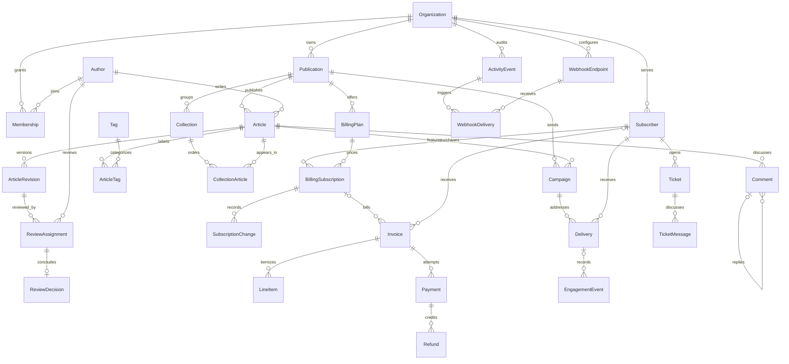

# Canopy validation and operating notes

Implemented in `apps/rails-8.0-large`: 29 domain tables, 31 ActiveRecord models,
and 399 extracted units (198 framework source). These notes record local validation
before the implementation commit. The smaller compatibility apps are unchanged.

## Evidence from September 14, 2026

Validated with Ruby 3.3.1, Rails 8.0.5.1, SQLite, and the local Woods checkout at
`8dce1c4b67d867a885b023416df4de710c0f99a4`. Docker ran on Linux. This is a local
validation run; the updated GitHub Actions workflow has not been run remotely.

- 32 application examples passed: request journeys, policies, stale approval,
  revision immutability, ownership, comment cycles, subscription activation,
  renewal/cancellation, retries, refunds, newsletter eligibility, and webhooks.
- Zeitwerk eager loading and Woods index validation passed.
- The existing kernel contract passed all 64 assertions, with no known-issue
  exclusion. The new functional contract passed 38/38 on the smoke profile and
  36/36 on stress (the two fixed smoke-only aggregate checks are omitted there).
- Existing general smoke: 10/10. Existing flow smoke: 31/31, including entry-point
  addition/removal and full/incremental flow-document equivalence. C-locale
  executable encoding smoke: 14/14. Extract-only boot/permission smoke: 8/8;
  the separate host UID also passed the permission proof. Worktree provenance
  smoke passed 3/3.
- The new disposable-source incremental checker passed concern fan-out into
  Article/Comment/Invoice, unchanged Billing::Plan content, equivalence with
  full extraction, and addition/removal of a PORO.
- Two independently schema-loaded smoke databases produced the same ordered-row
  fingerprint and 940 rows. Seed reruns preserved an interactive edit in a
  rolled-back test. The upgraded development database retained its historical
  kernel records, yielding 943 seeded rows instead.
- Browser validation completed demo entry, draft creation, revision display,
  review assignment, approval, publication, and public article rendering. The
  fictional browser-check article remains available in the development app.
- README/Compose consistency, Compose configuration, Ruby syntax, and whitespace
  checks passed. Application tables were migrated successfully from the existing
  kernel database; a fresh test database also prepared successfully.

## Dataset and query measurements

The report benchmark executes review backlog, overdue invoice joins, and grouped
newsletter outcomes for the `canopy` organization, with the reference clock fixed
at `2026-09-14T12:00:00Z`. It disables the ActiveRecord query cache. Seven samples
include a slower first call; these numbers are descriptive, not tail-latency SLOs.

| Profile | Rows | Seed seconds | Median report bundle, ms | Maximum, ms |
|---|---:|---:|---:|---:|
| Smoke, upgraded kernel | 943 | 2.797 | 14.21 | 139.15 |
| Demo, fresh schema | 46,235 | 39.151 | 12.84 | 131.61 |
| Stress, fresh schema | 488,201 | 515.460 | 13.82 | 141.29 |

These organization-scoped queries do not scan every record. Similar timings
across profiles do not imply every possible Console query scales equally well.
The stress data resides in a separate disposable database, leaving the normal
interactive database small.

## Source scale measurements

A disposable copy with 20 generated source families produced **564 units**, of
which 198 were framework source. Cold extraction took **1,423.9 ms**. Three timed
samples per source-change scenario gave these medians:

| Change | Median, ms | Units rewritten | Share of index |
|---|---:|---:|---:|
| Controller action | 355.6 | 11 | 2.0% |
| Article scope | 790.8 | 95 | 16.8% |
| Route | 562.8 | 212 | 37.6% |
| Schema file only | 249.6 | 0 | 0.0% |

The schema scenario changes `schema.rb` without migrating the live database;
it is an invalidation probe, **not** evidence of extracting a newly migrated
column. Database behavior is covered by the app migrations and contract checks.
The helper now resolves generation payloads, tolerates the new root route and
schema layout, reloads Rails, and restores both source and index between samples.
Timed extraction excludes those reload/restoration steps; use the independent
fresh-process checker for correctness.

Two forked extractor processes, two cycles each, reported about **129.3 MiB RSS
per process** and a **591.8 ms** write-to-generation change. Forked processes
share memory; summed RSS is an upper bound. This is the existing extractor-cycle
harness, not a long-lived production daemon or a macOS filesystem measurement.

Raw counts, provenance, timings, and caveats are in
[`benchmarks/canopy-2026-09-14.json`](benchmarks/canopy-2026-09-14.json). Source
benchmarks were captured before the final collection controls, click simulation,
comment counter, and route cleanup; retain them as that workload's baseline, not an exact count
of the final source tree. Subsequent baselines should include their testbed SHA.

CI gates correctness and a 900–1,100-row smoke budget. Timing results remain
informational until repeated same-host measurements establish a stable baseline.
A future performance gate should compare like-for-like source/profile/gem SHAs,
not absolute timings from different CI machines.

## Relationships

`ActivityEvent#subject` is polymorphic across Article, Subscription, and Ticket;
Ticket can reference an Invoice or Subscription. Payment retains card/bank STI.
Those shapes are also asserted against extracted metadata.

## Deliberate limits and proposal adjustments

- Woods exposes the publishing service's Article/job dependencies, but the tested
  extractor does not include every service-to-service reference as a graph edge.
  The functional contract checks supported edges and retrieves the corresponding
  service source. A static flow is not proof that a runtime effect occurred.
- Collections support ordered placement and tagging; newsletter delivery pages
  can record simulated click events. Comment counts use a maintained counter
  cache, backfilled by migration. Article state uses validated strings; payment
  state uses the existing AASM machine.
- The audience generator uses one featured story per campaign and caps events,
  keeping profiles bounded. The original profile counts were budgets; measured
  totals above supersede those estimates.
- Seed reruns preserve the whole existing dataset rather than selectively
  overwriting untouched records. A version/profile change requires an explicit
  reset or a new disposable database. This makes preservation predictable.
- Repeated payment/refund/job requests are idempotent under the implemented
  transaction/locking paths. This is SQLite development behavior, not a measured
  multi-writer production contention guarantee.
- Delivery adapters and the demo identity selector are local/test facilities.
  Durable scheduling, production auth, real network delivery, attachments, and
  provider-backed semantic retrieval remain outside this implementation.
